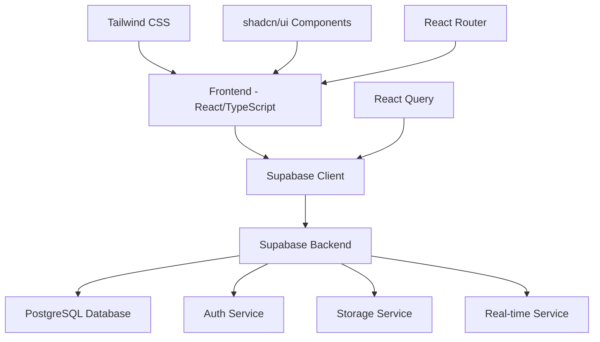

# Documento de Design - Sistema de Bolões Completo

## Overview

O Sistema de Bolões é uma aplicação web moderna construída com React, TypeScript, Supabase e Tailwind CSS. A arquitetura segue padrões de desenvolvimento modernos com foco em componentização, reutilização de código, segurança e experiência do usuário. O sistema utiliza autenticação baseada em JWT, Row Level Security (RLS) no banco de dados e design responsivo.

## Architecture

### Arquitetura Geral



### Estrutura de Pastas

```
src/
├── components/           # Componentes reutilizáveis
│   ├── ui/              # Componentes base (shadcn/ui)
│   ├── dashboard/       # Componentes específicos do dashboard
│   ├── pools/           # Componentes de bolões
│   ├── matches/         # Componentes de partidas
│   ├── bets/            # Componentes de palpites
│   ├── polls/           # Componentes de enquetes
│   ├── admin/           # Componentes administrativos
│   └── common/          # Componentes comuns
├── pages/               # Páginas da aplicação
├── hooks/               # Custom hooks
├── lib/                 # Utilitários e configurações
├── types/               # Definições de tipos TypeScript
├── services/            # Serviços de API
└── styles/              # Estilos globais
```

## Components and Interfaces

### Componentes Principais

#### 1. Sistema de Autenticação
- **AuthModal**: Modal unificado para login/cadastro
- **ProtectedRoute**: Wrapper para rotas protegidas
- **AuthProvider**: Context provider para estado de autenticação

#### 2. Dashboard
- **DashboardLayout**: Layout principal com sidebar
- **DashboardStats**: Estatísticas do usuário
- **ActivePools**: Lista de bolões ativos
- **RecentActivity**: Feed de atividades recentes
- **UserRanking**: Ranking geral de usuários

#### 3. Gerenciamento de Bolões
- **PoolsList**: Lista de bolões disponíveis
- **PoolCard**: Card individual de bolão
- **CreatePoolForm**: Formulário de criação de bolão
- **PoolDetails**: Detalhes completos do bolão
- **PoolSettings**: Configurações do bolão
- **InviteUsers**: Sistema de convites

#### 4. Sistema de Palpites
- **MatchesList**: Lista de partidas
- **MatchCard**: Card individual de partida
- **BetForm**: Formulário de palpite
- **BetHistory**: Histórico de palpites
- **BetStats**: Estatísticas de palpites

#### 5. Rankings e Classificações
- **RankingTable**: Tabela de ranking
- **RankingCard**: Card de posição no ranking
- **StatsChart**: Gráficos de estatísticas
- **PerformanceMetrics**: Métricas de performance

#### 6. Sistema de Enquetes
- **PollsList**: Lista de enquetes
- **PollCard**: Card de enquete
- **CreatePollForm**: Formulário de criação de enquete
- **PollResults**: Resultados da enquete
- **VoteButton**: Botão de votação

#### 7. Painel Administrativo
- **AdminDashboard**: Dashboard administrativo
- **UserManagement**: Gerenciamento de usuários
- **PoolManagement**: Gerenciamento de bolões
- **MatchManagement**: Gerenciamento de partidas
- **SystemSettings**: Configurações do sistema

### Interfaces TypeScript

```typescript
// Tipos principais
interface User {
  id: string;
  username: string;
  email: string;
  role: 'admin' | 'participant';
  avatar_url?: string;
  created_at: string;
  updated_at: string;
}

interface Pool {
  id: string;
  name: string;
  description: string;
  creator_id: string;
  status: 'draft' | 'open' | 'active' | 'finished';
  max_participants?: number;
  prize_amount?: number;
  start_date: string;
  end_date: string;
  scoring_rules: ScoringRules;
  created_at: string;
  updated_at: string;
}

interface Match {
  id: string;
  pool_id: string;
  home_team: string;
  away_team: string;
  match_date: string;
  home_score?: number;
  away_score?: number;
  status: 'scheduled' | 'live' | 'finished' | 'cancelled';
  created_at: string;
  updated_at: string;
}

interface Bet {
  id: string;
  user_id: string;
  match_id: string;
  home_score_prediction: number;
  away_score_prediction: number;
  points_earned?: number;
  created_at: string;
  updated_at: string;
}

interface Poll {
  id: string;
  title: string;
  description: string;
  status: 'draft' | 'open' | 'closed';
  start_date: string;
  end_date: string;
  created_at: string;
  updated_at: string;
}

interface PollOption {
  id: string;
  poll_id: string;
  text: string;
  votes_count: number;
  created_at: string;
}

interface ScoringRules {
  exact_score: number;
  correct_winner: number;
  correct_draw: number;
}
```

## Data Models

### Modelo de Dados do Banco

```sql
-- Tabela de perfis (já existente)
CREATE TABLE profiles (
  id uuid PRIMARY KEY REFERENCES auth.users(id),
  username text UNIQUE NOT NULL,
  email text UNIQUE NOT NULL,
  role user_role DEFAULT 'participant',
  avatar_url text,
  total_points integer DEFAULT 0,
  created_at timestamptz DEFAULT now(),
  updated_at timestamptz DEFAULT now()
);

-- Tabela de bolões (já existente, precisa ajustes)
CREATE TABLE pools (
  id uuid PRIMARY KEY DEFAULT gen_random_uuid(),
  name text NOT NULL,
  description text,
  creator_id uuid REFERENCES profiles(id),
  status pool_status DEFAULT 'draft',
  max_participants integer,
  prize_amount decimal(10,2),
  invite_code text UNIQUE,
  scoring_rules jsonb DEFAULT '{"exact_score": 3, "correct_winner": 1, "correct_draw": 1}',
  start_date timestamptz,
  end_date timestamptz,
  created_at timestamptz DEFAULT now(),
  updated_at timestamptz DEFAULT now()
);

-- Tabela de participantes de bolões
CREATE TABLE pool_participants (
  id uuid PRIMARY KEY DEFAULT gen_random_uuid(),
  pool_id uuid REFERENCES pools(id) ON DELETE CASCADE,
  user_id uuid REFERENCES profiles(id) ON DELETE CASCADE,
  joined_at timestamptz DEFAULT now(),
  UNIQUE(pool_id, user_id)
);

-- Tabela de partidas (já existente, precisa ajustes)
CREATE TABLE matches (
  id uuid PRIMARY KEY DEFAULT gen_random_uuid(),
  pool_id uuid REFERENCES pools(id) ON DELETE CASCADE,
  home_team text NOT NULL,
  away_team text NOT NULL,
  match_date timestamptz NOT NULL,
  home_score integer,
  away_score integer,
  status match_status DEFAULT 'scheduled',
  created_at timestamptz DEFAULT now(),
  updated_at timestamptz DEFAULT now()
);

-- Tabela de palpites (já existente, precisa ajustes)
CREATE TABLE user_bets (
  id uuid PRIMARY KEY DEFAULT gen_random_uuid(),
  user_id uuid REFERENCES profiles(id) ON DELETE CASCADE,
  match_id uuid REFERENCES matches(id) ON DELETE CASCADE,
  home_score_prediction integer NOT NULL,
  away_score_prediction integer NOT NULL,
  points_earned integer DEFAULT 0,
  created_at timestamptz DEFAULT now(),
  updated_at timestamptz DEFAULT now(),
  UNIQUE(user_id, match_id)
);

-- Tabela de enquetes (já existente)
CREATE TABLE polls (
  id uuid PRIMARY KEY DEFAULT gen_random_uuid(),
  title text NOT NULL,
  description text,
  status poll_status DEFAULT 'draft',
  start_date timestamptz,
  end_date timestamptz,
  created_at timestamptz DEFAULT now(),
  updated_at timestamptz DEFAULT now()
);

-- Tabela de opções de enquetes (já existente)
CREATE TABLE poll_options (
  id uuid PRIMARY KEY DEFAULT gen_random_uuid(),
  poll_id uuid REFERENCES polls(id) ON DELETE CASCADE,
  text text NOT NULL,
  votes_count integer DEFAULT 0,
  created_at timestamptz DEFAULT now()
);

-- Tabela de votos em enquetes (já existente)
CREATE TABLE user_poll_votes (
  id uuid PRIMARY KEY DEFAULT gen_random_uuid(),
  user_id uuid REFERENCES profiles(id) ON DELETE CASCADE,
  poll_id uuid REFERENCES polls(id) ON DELETE CASCADE,
  option_id uuid REFERENCES poll_options(id) ON DELETE CASCADE,
  created_at timestamptz DEFAULT now(),
  UNIQUE(user_id, poll_id)
);

-- Tabela de notificações
CREATE TABLE notifications (
  id uuid PRIMARY KEY DEFAULT gen_random_uuid(),
  user_id uuid REFERENCES profiles(id) ON DELETE CASCADE,
  title text NOT NULL,
  message text NOT NULL,
  type notification_type,
  read boolean DEFAULT false,
  data jsonb,
  created_at timestamptz DEFAULT now()
);

-- Tabela de atividades
CREATE TABLE activities (
  id uuid PRIMARY KEY DEFAULT gen_random_uuid(),
  user_id uuid REFERENCES profiles(id) ON DELETE CASCADE,
  type activity_type NOT NULL,
  description text NOT NULL,
  data jsonb,
  created_at timestamptz DEFAULT now()
);

-- Enums necessários
CREATE TYPE pool_status AS ENUM ('draft', 'open', 'active', 'finished');
CREATE TYPE match_status AS ENUM ('scheduled', 'live', 'finished', 'cancelled');
CREATE TYPE poll_status AS ENUM ('draft', 'open', 'closed');
CREATE TYPE notification_type AS ENUM ('bet_reminder', 'result_update', 'pool_invite', 'ranking_change');
CREATE TYPE activity_type AS ENUM ('bet_placed', 'pool_joined', 'poll_voted', 'ranking_improved');
```

## Error Handling

### Estratégia de Tratamento de Erros

1. **Erros de Autenticação**
   - Redirecionamento automático para login
   - Mensagens de erro claras
   - Renovação automática de tokens

2. **Erros de Validação**
   - Validação client-side com Zod
   - Feedback visual imediato
   - Mensagens específicas por campo

3. **Erros de Rede**
   - Retry automático para falhas temporárias
   - Modo offline com cache local
   - Indicadores de status de conexão

4. **Erros de Permissão**
   - Verificação de RLS no banco
   - Mensagens de acesso negado
   - Redirecionamento para páginas apropriadas

### Implementação de Error Boundaries

```typescript
// ErrorBoundary component
class ErrorBoundary extends React.Component {
  constructor(props) {
    super(props);
    this.state = { hasError: false, error: null };
  }

  static getDerivedStateFromError(error) {
    return { hasError: true, error };
  }

  componentDidCatch(error, errorInfo) {
    console.error('Error caught by boundary:', error, errorInfo);
    // Log to monitoring service
  }

  render() {
    if (this.state.hasError) {
      return <ErrorFallback error={this.state.error} />;
    }
    return this.props.children;
  }
}
```

## Testing Strategy

### Estratégia de Testes

1. **Testes Unitários**
   - Componentes individuais com React Testing Library
   - Hooks customizados
   - Funções utilitárias
   - Cobertura mínima de 80%

2. **Testes de Integração**
   - Fluxos completos de usuário
   - Integração com Supabase
   - Testes de formulários
   - Navegação entre páginas

3. **Testes End-to-End**
   - Cypress para fluxos críticos
   - Testes de autenticação
   - Criação e participação em bolões
   - Sistema de palpites

4. **Testes de Performance**
   - Lighthouse CI
   - Bundle size monitoring
   - Core Web Vitals
   - Load testing

### Configuração de Testes

```typescript
// jest.config.js
module.exports = {
  testEnvironment: 'jsdom',
  setupFilesAfterEnv: ['<rootDir>/src/test/setup.ts'],
  moduleNameMapping: {
    '^@/(.*)$': '<rootDir>/src/$1',
  },
  collectCoverageFrom: [
    'src/**/*.{ts,tsx}',
    '!src/**/*.d.ts',
    '!src/test/**',
  ],
  coverageThreshold: {
    global: {
      branches: 80,
      functions: 80,
      lines: 80,
      statements: 80,
    },
  },
};
```

## Security Considerations

### Medidas de Segurança

1. **Autenticação e Autorização**
   - JWT tokens com refresh automático
   - Row Level Security (RLS) no Supabase
   - Verificação de permissões em cada operação
   - Rate limiting para APIs

2. **Validação de Dados**
   - Validação client-side e server-side
   - Sanitização de inputs
   - Prevenção de SQL injection
   - Validação de tipos com TypeScript

3. **Proteção contra Ataques**
   - CSRF protection
   - XSS prevention
   - Content Security Policy
   - HTTPS obrigatório

4. **Privacidade de Dados**
   - Conformidade com LGPD
   - Criptografia de dados sensíveis
   - Logs de auditoria
   - Política de retenção de dados

### Implementação de RLS

```sql
-- Políticas de segurança já implementadas
-- Exemplo de política adicional para participantes
CREATE POLICY "Users can view pools they participate in" ON pools
  FOR SELECT USING (
    id IN (
      SELECT pool_id FROM pool_participants 
      WHERE user_id = auth.uid()
    )
    OR creator_id = auth.uid()
    OR status = 'open'
  );
```

## Performance Optimization

### Otimizações de Performance

1. **Frontend**
   - Code splitting por rotas
   - Lazy loading de componentes
   - Memoização com React.memo
   - Otimização de re-renders

2. **Dados**
   - React Query para cache
   - Paginação de listas grandes
   - Debounce em buscas
   - Prefetch de dados críticos

3. **Assets**
   - Compressão de imagens
   - Bundle optimization
   - CDN para assets estáticos
   - Service Worker para cache

4. **Database**
   - Índices otimizados
   - Queries eficientes
   - Connection pooling
   - Cache de queries frequentes

### Métricas de Performance

- First Contentful Paint < 1.5s
- Largest Contentful Paint < 2.5s
- Cumulative Layout Shift < 0.1
- First Input Delay < 100ms
- Bundle size < 500KB gzipped